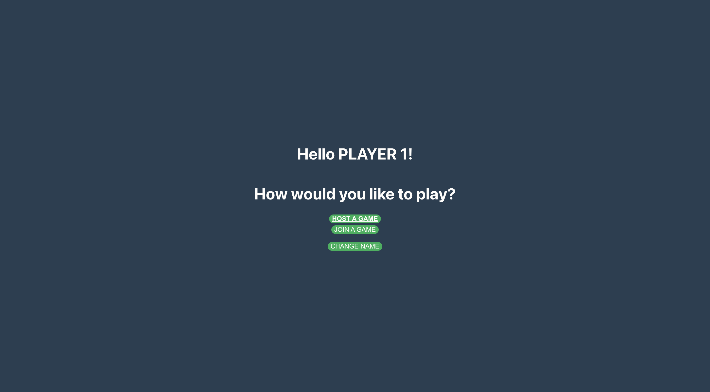
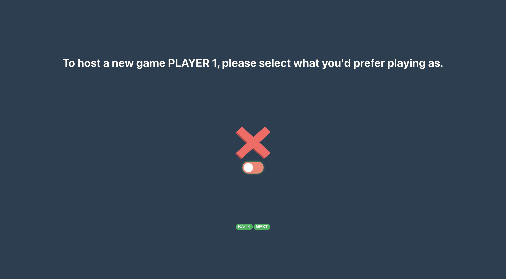
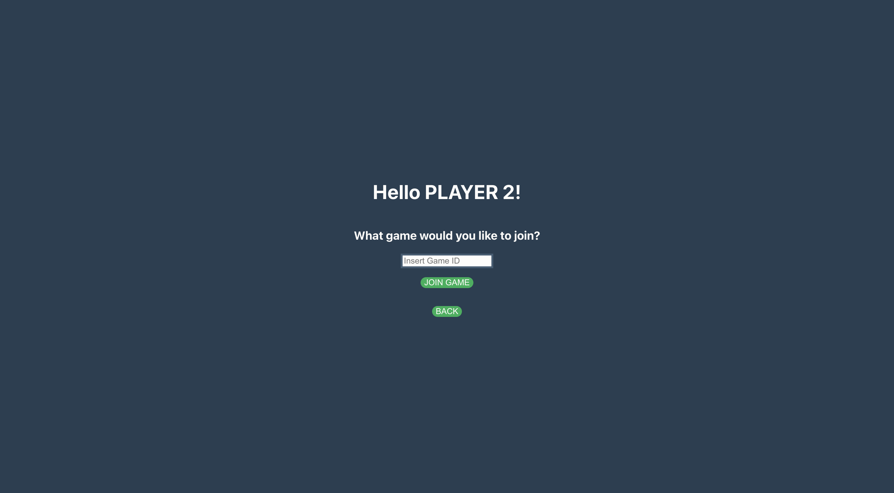
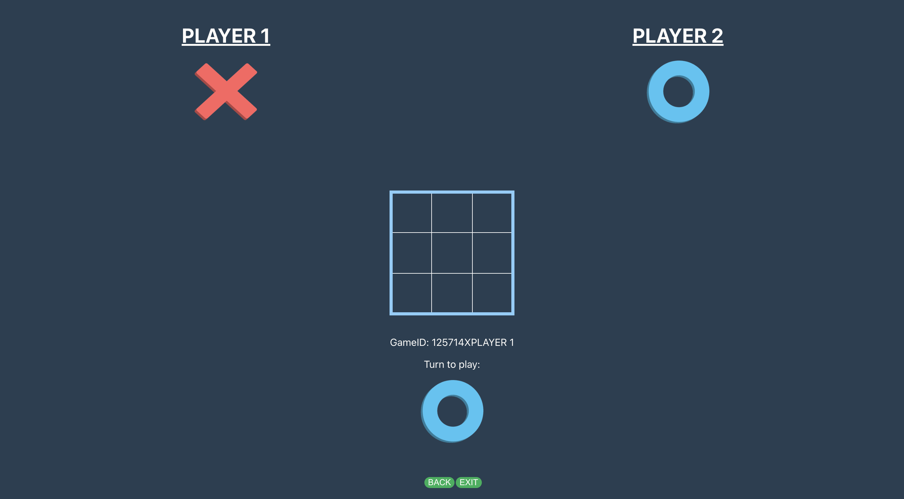

# Tic-Tac-Toe
This is a web-based Tic-Tac-Toe game built using ReactJS.

# Features
- Two-player mode
- Real-time gameplay using websockets
- Responsive design for various screen sizes

# Installation
- Clone the repository
- Install dependencies for the client
- Start the client
- Open your browser and navigate to http://localhost:3001 to play the game.

- For development purposes, you can change the socket address in 'App.js' to 'localhost' by swapping the commented lines 21 and 22. This allows you to run the server locally and reference the client to that address.

# Usage
Once the application is running, simply navigate to http://localhost:3001 in your browser to start playing the game.

# Dependencies
- Node.js
- Express
- React
- React Router
- Socket.io

# Screenshots
Home screen:

Hosting a game:

Joining a game:

Playing a game:

